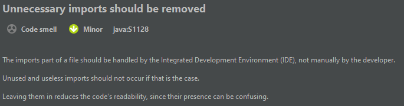

# IET házi

## Manuális kód analízis
A SonarLint álltal jelzett hibák fájlonként: 
### Beans.java:
* Remove unused import: Egy nem használt import maradt a fájlban.
    * Hiba megoldása: eltávolítottam a felesleges importot.

