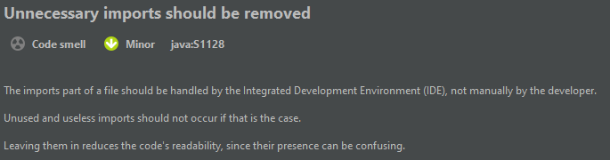
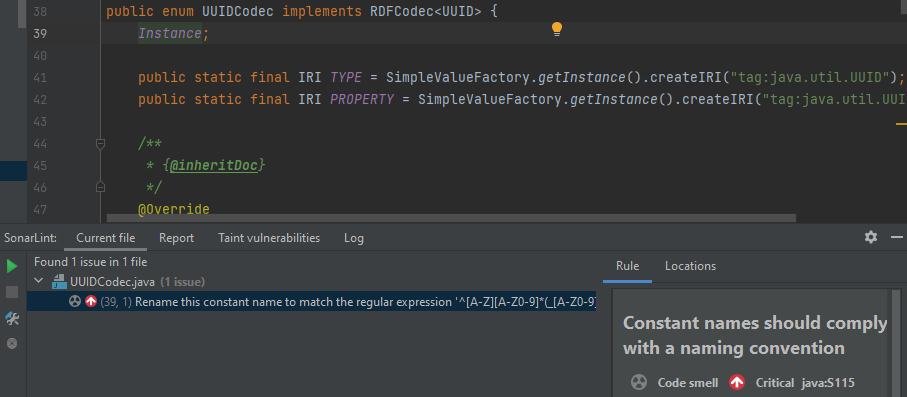
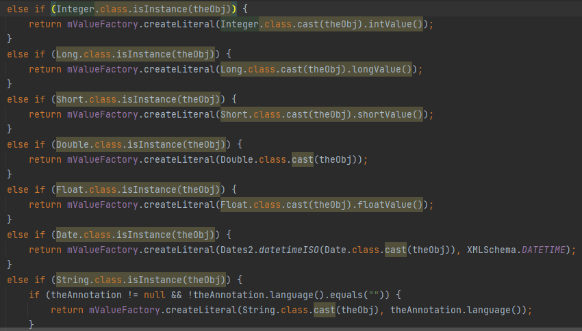

# Manuális kód analízis

A SonarLint álltal jelzett hibák fájlonként:

## Beans.java:

* Remove unused import: Egy nem használt import maradt a fájlban.
* Hiba megoldása: eltávolítottam a felesleges importot.
	

## UUIDCodec.java:

* 
* Hiba: A SonarLint egy kód smell-t talált. Az enum-okat csupa nagybetűvel szokás elnevezni, azonban az Instance esetén ez nem így történt.
* Javítás: Átírtuk nagybetűs INSTANCE-re, és így már rendben volt.

## RDFMapper.java:

* 
* Hibák: Az "A.class.isInstance()" helyett az instanceof metódus használata javasolt. A kódban itt többször egymás után előfordul ez a hiba.
* Javítás: Kicserélbem `theObj instanceof Boolean` formára az ilyen hibás sorokat.