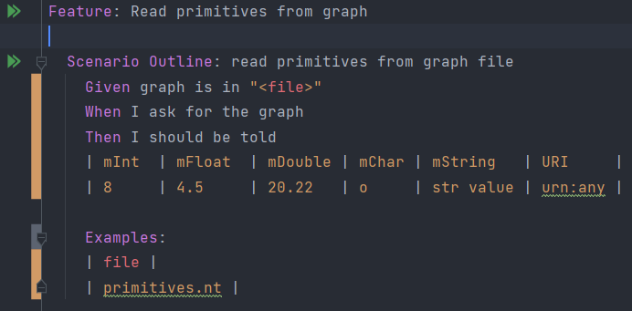
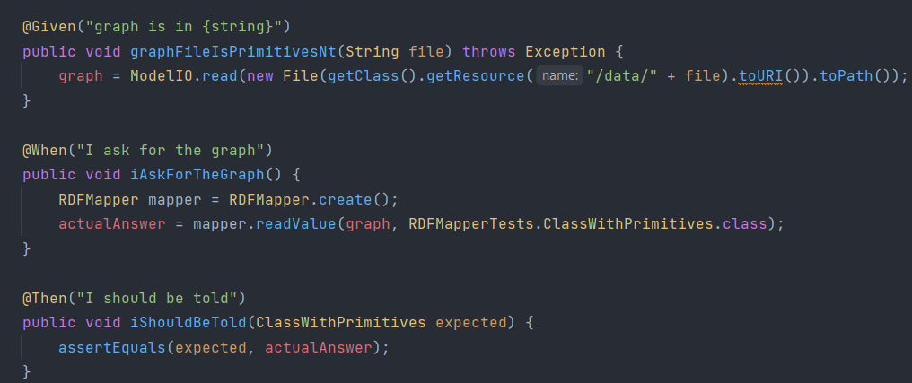

# BDD tesztek

## Cucumber hozzáadása a projekthez

task hozzáadása a gradle-höz:

## BDD tesztek készítése

### Read primitives from graph

Ellenőrzi az olyan gráf beolvasását amely primitíveket tartalmaz.

Ehhez létre kellett hozni egy konvertálót ami a DataTable-ből egy ClassWithPrimitives példányt hoz létre:

Teszt leírása a .feature fájlban:

Step definitions:

Sikeres lefutás:

### Read lists of primitives from graph

Ellenőrzi az olyan gráf beolvasását amely primitívekből álló listákat tartalmaz.

Az előző teszthez hasonlóan létrehoztam egy új konvertáló függvényt a ClassWithPrimitiveLists osztályhoz:

Teszt leírása a .feature fájlban:

A lépések leírása hasonló az előző teszthez.