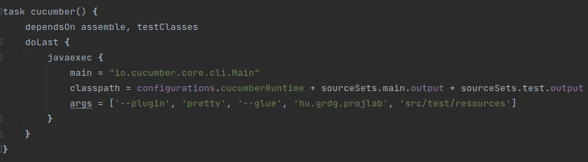
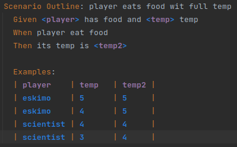
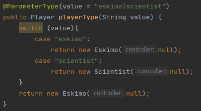
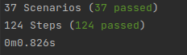

# BDD tesztek

A BDD teszteket cucumber segítségével készítettük el.

## Cucumber konfigurálása

 A build.gradle-t a következő sorokkal egészítettük ki:

## Tesztek

Összesen 7 feature-t teszteltünk a programban amelyek összesen 37 Scenariot (esetet) fednek le és 127 lépésből állnak

A feature-öket Gherkin nyelven írtuk le és arra törekedtünk, hogy minél kevesebb legyen a kódduplikáció, így a legtöbb esetben Scenario Outline-t és Example-ket használtunk. 

Azért, hogy a mondatok minél érthetőbbek legyenek ParameterType-ot alkalmaztunk:

A tesztek sikeresen lefutottak:

