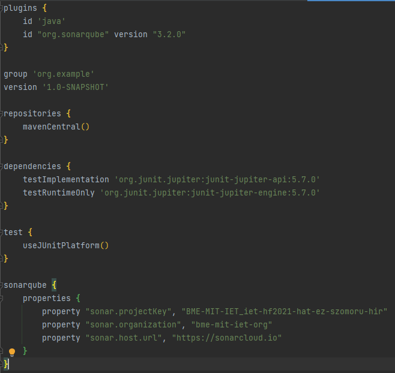
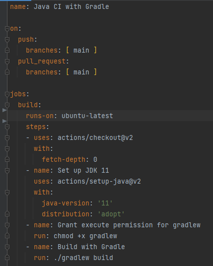
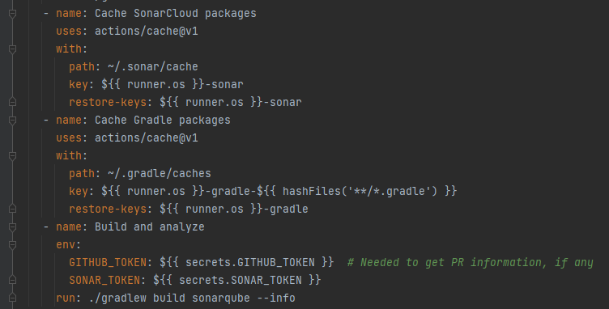
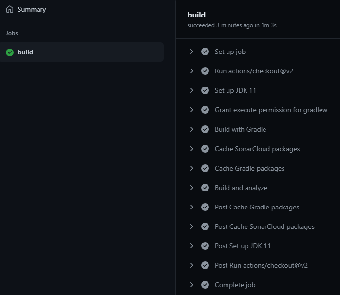
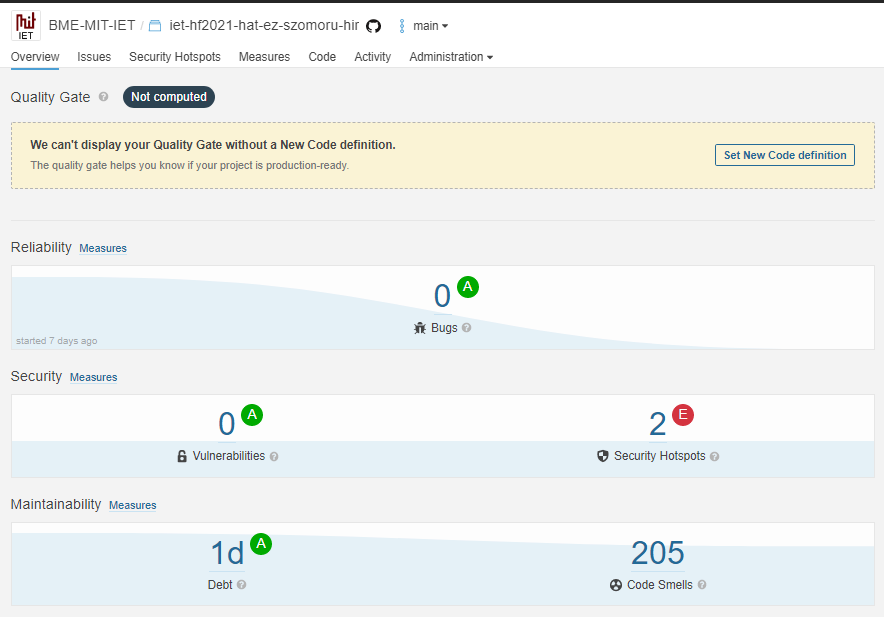
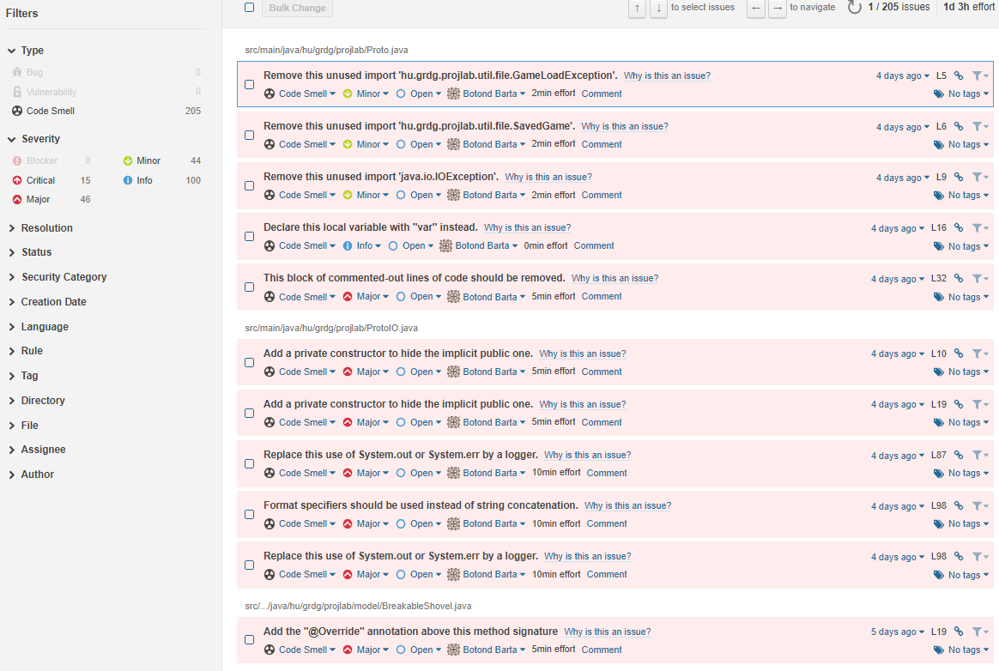
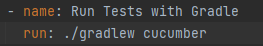

# Build keretrendszer beüzemelése + CI beüzemelése

A projektet gradle-ös projektként hoztuk létre, hogy build-elhető legyen. Ebbe a build.gradle fájlba bekerült a sonarqube mint plugin.

Majd GitHub-on létrehoztuk a gradle action-t, hogy push-olás és pull request esetén fordítsa le a programot. Ebbe a gradle.yaml-be belekerült az is, hogy a sonarqube is értékelje ki a projektünket.

Build lefutása:

Az első SonarQube futtatás eredménye az alábbi volt:

A CI-ba bekerült, hogy a cucumberben elkészített teszteket automatikusan kiértékelje:

