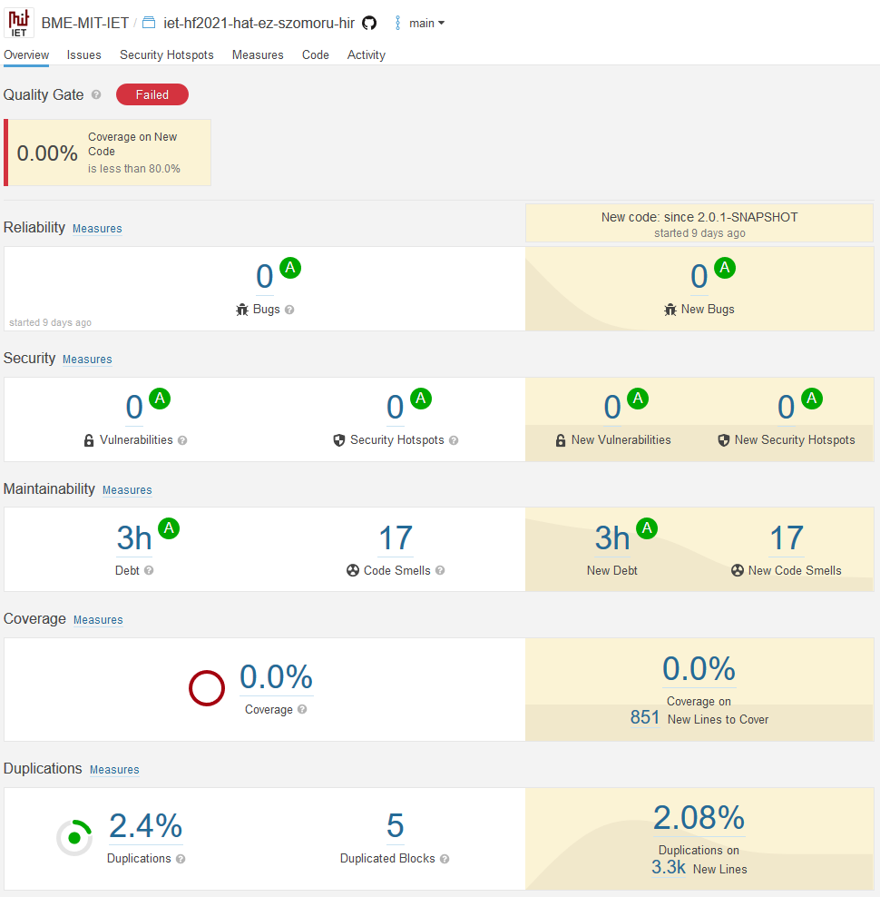
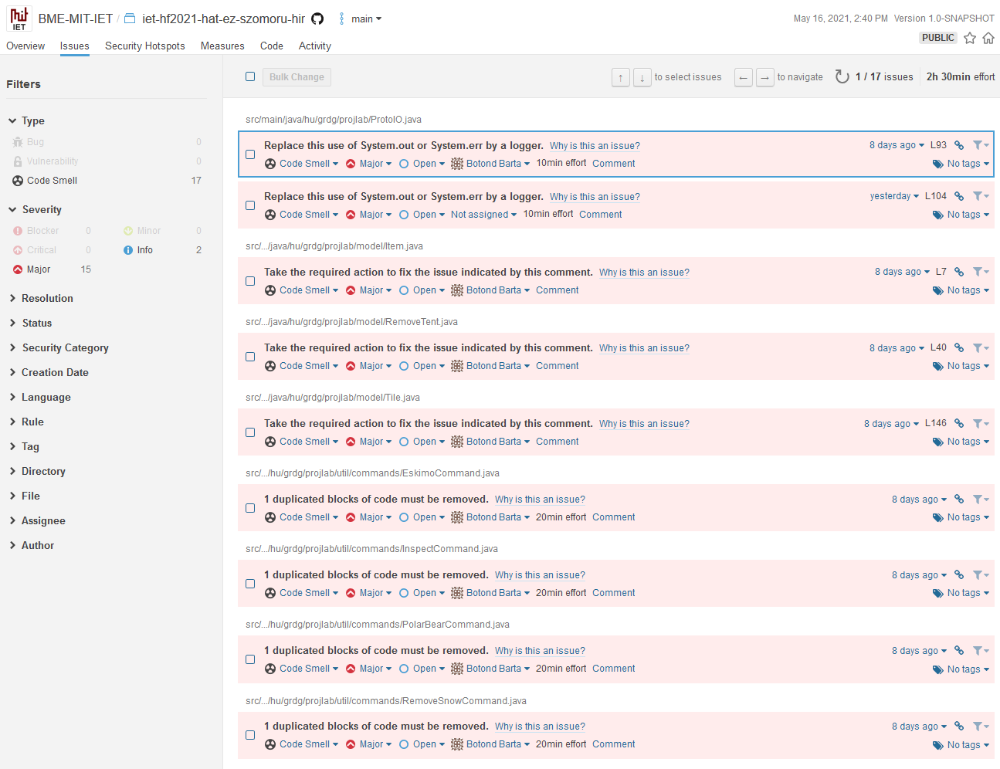

# Manuális kód átvizsgálás és statikus kódelemzés

A projekt CI pipeline felépítésekor a SonarCloud statikus kódvizsgálás szolgáltatással összekötöttük a kódot. Kezdetben a SonarCloud felülete nagyon sok code smellt jelzett.

 
Látható, hogy 205 code smell volt a kódbázisban, és 2 biztonsági kockázat.

A kezdeti hibák listája. Látszik, hogy 15 kritikus, és 46 jelentős code smell volt a programban.

Ezen hibák között voltak triviálisan javíthatóak, és nehezebbek is, igyekeztünk a legtöbb olyan hibát is javítani, ami nem egy egyszerű IDE által felajánlott refactor művelettel megodható.

Az alábbi képeken lehet látni a végleges programkód helyzetét:

Látható, hogy a hibák jelentős részét (90+%-át) kijavítottuk. A megmaradt problémák két csoportba sorolhatóak: vagy nem tekintettük tényleges hibának, vagy alapvető architekturális változtatásokat venne igénybe.