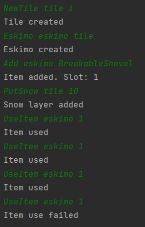

# Build iglu on IceTile

## Arrange
- egy IceTile
- az IceTile-on egy Eskimo
- az Eskimo-nak van egy BreakableShovel-je
- 10 egység hó van az IceTile-on

## Act
- az Eskimo megpróbál eltakarítani négyszer 2 egység havat az IceTileról

## Assert
- csak háromszor tud havat eltakarítani

## Result
