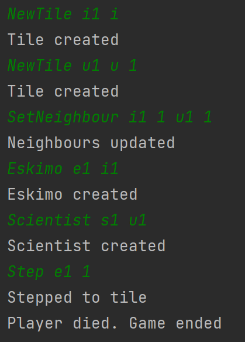

# Player steps on filled unstable tile

## Arrange
- egy stabil és egy instabil IceTile egymás mellett
- a stabil IceTile 1 embert bír el maximum
- egy Eskimo a stabil IceTile-on
- egy Scientist az instabil IceTile-on

## Act
- az Eskimo átlép az instabil IceTile-ra

## Assert
- az instabil IceTile két embert már nem bír el, így vége a játéknak

## Result
