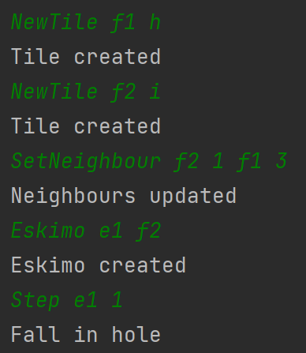

# Player steps on HoleTile

## Arrange
- egy IceTile és egy HoleTile egymás mellett
- az IceTile-on egy Eskimo

## Act
- az Eskimo átlép a HoleTile-ra

## Assert
- az Eskimo a lukba esik

## Result
