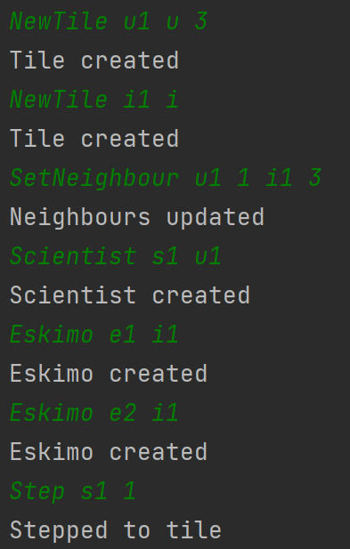

# Player steps on unfilled unstable tile

## Arrange
- egy stabil és egy instabil IceTile egymás mellett
- az instabil IceTile 3 embert bír el maximum
- egy Scientist a stabil IceTile-on áll
- két Eskimo az instabil IceTile-on áll

## Act
- a Scientist átlép az instabil IceTile-ra

## Assert
- az instabil IceTile három embert elbír, így sikeres az átlépés

## Result
