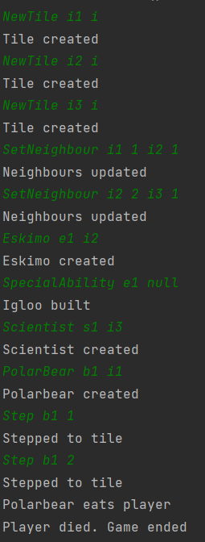

# Polar bear test

## Arrange
- három IceTile egymás mellett
- az első IceTile-on áll a PolarBear
- a második Tileon van egy Eskimo és egy iglu
- a harmadikon egy Scientist iglu nélkül

## Act
- a PolarBear átlép a második Tile-ra 
- a PolarBear átlép a harmadik Tile-ra

## Assert
- az Eskimonak nem esik bántódása
- a Scientist-et megtámadja a PolarBear, végetér a játék

## Result
