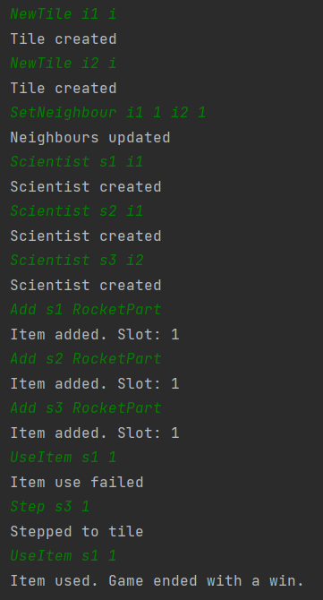

# Build Rocket

## Arrange
- két szomszédos IceTile
- az első IceTile-on két Scientist
- a másodikon egy Scientist  
- mindhárom Scientist-nél van egy-egy RocketPart

## Act
- megpróbálják összeszerelni a Rocket-et
- a harmadik Scientist átlép az első Tile-ra
- újból megpróbálják összeszerelni a Rocket-et

## Assert
- az első esetben nem sikerül nekik összeszerelni a Rocket-et
- a második esetben sikerrel járnak
- a játék végetér

## Result
