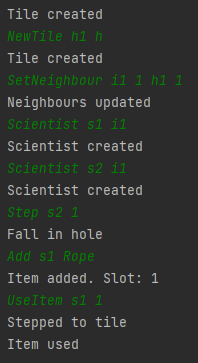

# Rope Usage

## Arrange
- egy IceTile és egy HoleTile egymás mellett
- az IceTile-on két Scientist
- az 1-es számú Scientist-nél van egy Rope

## Act
- a 2-es számú Scientist átlép a Hole mezőre
- a következő lépésben az 1-es számú Scientist használja a Rope-ot

## Assert
- a 2-es számú Scientist beleesik a Hole-ba
- a 2-es számú Scientist kimentődik a Hole-ból

## Result
