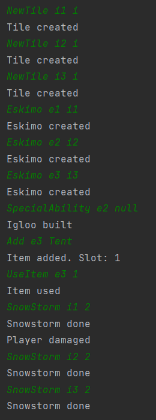

# Snow storm test

## Arrange
- három szomszédos IceTile
- az elsőn egy Eskimo
- a másodikon egy Eskimo Igluval
- a harmadikon egy Eskimo Tent-tel

## Act
- kitör a hóvihar

## Assert
- az első Tile-on lévő Eskimonak fogy az élete
- a másik kettőnek nem lesz baja

## Result
