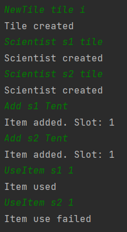

# Tent setup

## Arrange
- egy IceTile
- az IceTile-on két Scientist
- mindkettőnél egy-egy sátor

## Act
- az első Scientist megpróbálja felállítani a sátrat
- az második Scientist is megpróbálja felállítani a sátrat

## Assert
- az első sikeresen felállítja a Tent-et
- a második már nem tudja felállítani

## Result
