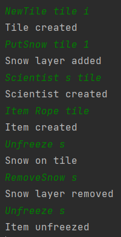

# Unfreeze frozen item

## Arrange
- egy IceTile, rajta hóval
- az IceTile-on egy Scientist
- a Tile-ba fagyva egy köték

## Act
- a Scientist megpróbálja felvenni a kötelet
- eltakarítja a havat  
- a Scientist újra megpróbálja felvenni a kötelet

## Assert
- elsőre nem tudja felvenni
- a második próbálkozásra sikerrel jár

## Result
